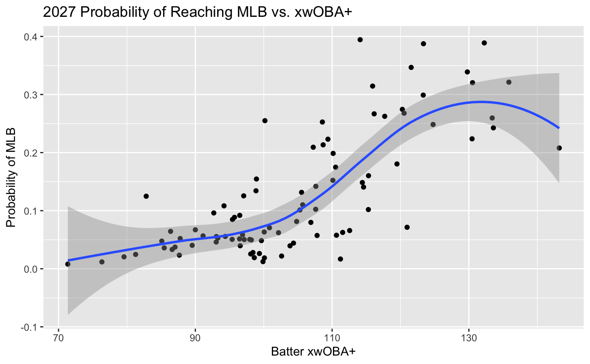
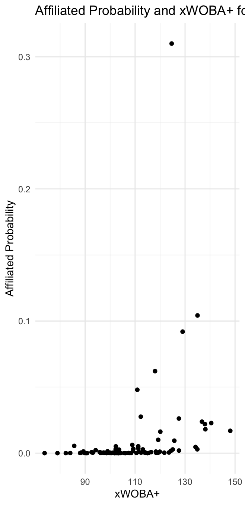

```{r setup, include=FALSE}
knitr::opts_chunk$set(echo = TRUE)
```


# Abstract
The New York Boulders are a professional independent league baseball team located in Pomona, New York. They are in the Frontier League, which has recently enacted a partnership with Yakkertech, a data solutions company that enables the Boulders to collect important player performance metrics within their stadium. These include hitting data like exit velocity and launch angle and pitching data like velocity and spin rate. The unpaid internship I did this summer is with the Boulders' Baseball Analytics department, where I set up the Yakkertech system and collected data throughout home games. This internship has given me access to league-wide collected data. There is also freely available supplemental Statcast data dating back to 2021 of the Florida State League (a single-A league, somewhat equivalent to the Frontier League).  In S&DS 425, I plan to use the collected data and supplemental data to come up with a multinomial logistic regression determining the probability that each player in the Frontier League reaches higher levels of the affiliate minor leagues (Single-A, Double-A, Triple-A) or even Major League Baseball. These sorts of projects have been done before, but not using a combination of independent league data and available Statcast data.

# Introduction
## Independent Baseball
Independent baseball occupies a unique space within the broader ecosystem of professional baseball. Unlike teams affiliated with Major League Baseball (MLB) organizations, independent leagues operate outside the traditional farm system structure. This arrangement provides players who might have slipped through the cracks—or are looking to resurrect their careers—an opportunity to showcase their abilities and potentially gain the attention of MLB scouts. Independent leagues must often leverage innovative strategies to drive fan engagement and revenue, fostering a rich environment of entrepreneurship and community-based support. The quality of play in these leagues has improved markedly in recent years, with some organizations rivaling the talent found in the lower levels of affiliated systems.

## Origins and Growth of the Frontier League
The Frontier League was established in 1993 as an independent professional baseball league, initially serving smaller markets without access to affiliated minor league teams. Over the past three decades, the league has grown in both size and stature, now consisting of 16 teams across the United States and Canada. Its success lies in its ability to provide high-quality baseball while maintaining a strong community presence. The league has a long history of sending players to MLB-affiliated teams, highlighting its role as a developmental pipeline for overlooked or underutilized talent. The recent partnership with Major League Baseball, granting it the status of an MLB Partner League, underscores its growing legitimacy and importance in the baseball ecosystem.

## Relations with Affiliated Baseball
In 2020, the Frontier League became one of MLB’s Partner Leagues, signifying closer ties between independent baseball and the affiliated minor league system. This designation allows the Frontier League to share resources and data with MLB while maintaining its autonomy. For players, this relationship enhances visibility and opportunities to advance into affiliated baseball. The league has adopted various MLB-inspired rules and technologies, further integrating itself into the broader baseball landscape. This collaboration represents a mutual benefit: MLB gains a developmental resource for evaluating players outside its traditional system, while the Frontier League solidifies its reputation as a legitimate stepping stone to higher levels of professional baseball.

## Yakkertech and BaseballCloud
A major development in the Frontier League’s evolution has been its adoption of advanced player performance technologies like Yakkertech. Yakkertech is a cutting-edge data collection system capable of tracking granular player metrics such as pitch velocity, spin rate, exit velocity, and launch angle. These statistics provide teams with valuable insights into player performance and potential, allowing for more informed decision-making in player development and scouting. The collected data is stored and analyzed using BaseballCloud, a software platform that integrates and visualizes performance metrics for players, coaches, and analysts. This technology has revolutionized the evaluation process in independent baseball, offering Frontier League teams the same level of analytical depth previously reserved for MLB-affiliated organizations.

## Statcast Minor League Baseball
Statcast, Major League Baseball’s premier data-tracking technology, has become a cornerstone of modern baseball analytics. Originally introduced at the MLB level in 2015, Statcast has gradually expanded its reach into affiliated minor league baseball, providing a wealth of data on player performance across all levels of the minor league system. Since 2021, Statcast has been implemented in the Florida State League (FSL), a Single-A league comparable in talent level to the Frontier League. This expansion has made advanced metrics, such as pitch velocity, spin rate, exit velocity, and defensive positioning, readily available for analysis at lower levels of professional baseball.

For this study, Statcast data from the Florida State League serves as a critical benchmark for evaluating Frontier League players. By leveraging this dataset, we can identify similarities and differences in player performance metrics across the two leagues. These insights enable the development of a multinomial logistic regression model that predicts the likelihood of Frontier League players advancing to higher levels of the affiliated minor league system or even Major League Baseball. The availability of Statcast data at the minor league level not only enhances the scope of this analysis but also highlights the growing importance of advanced analytics in evaluating and developing baseball talent at all levels.

## This Study
This study explores the potential trajectories of Frontier League players by leveraging advanced player performance data collected through Yakkertech and publicly available Statcast data from the Florida State League. The primary objective is to determine the likelihood of Frontier League players reaching higher levels of professional baseball, such as Single-A, Double-A, Triple-A, or even Major League Baseball.

Using a multinomial logistic regression model, this analysis integrates performance metrics such as exit velocity, launch angle, pitch velocity, and spin rate, among others. These metrics are compared between Frontier League players and their counterparts in the Florida State League, a Single-A league with a comparable talent level. By aligning the two datasets, this study bridges the gap between independent and affiliated baseball, providing insights into how performance in the Frontier League translates to affiliated baseball.

We use another multinomial logistic regression model to compare Frontier League players in 2023 and Frontier League players in 2024 to predict where 2024's players will end up next year.

# Data Exploration and Visualization with 2023 Data
## Section 1: Data Cleaning
To begin, I downloaded the CSV files from the OnePoint Shared Folder, which contained pitch-by-pitch data for the 2023 and 2024 Frontier League seasons. I then wrote a function `process_season` to process the season's worth of data, which I had downloaded locally into folders titled "2023" and "2024". `process_season` was able to connect to MySQL and write the data row by row into a SQL table while recognizing the headers. R is able to handle the large amounts of data I have (over 300,000 rows per season of over 100 columns), but it takes a while to load, so I thought that working with SQL to select columns from the database would work best. Due to the fact that we are taking at-bats as independent events, the goal was to take the game-by-game pitch data and turn it into season-by-season pitch data. Thus, we do not care when a pitch occurred or who threw the pitch. We just care about each batter's outcomes. Thus, we have two SQL Tables, one for Frontier League 2023 pitches, and one for 2024 pitches. 

Note about notation: 
- ExitSpeed = Exit Velocity of a batted ball
- Angle = Launch Angle of a batted ball
- xBA = Expected Batting Average of a batted ball
- xSLG = Expected Slugging Percentage of a batted ball
- xWOBA = Expected Weighted On-Base Average of a batted ball
- xOBP = Expected On-Base Percentage of a batted ball
- xOPS = Expected On-Base Plus Slugging Percentage of a batted ball
- K% = Strikeout Percentage of a batter
- BB% = Walk Percentage of a batter

## Section 2: Is Direction a Good Predictor of Hits?
The first thing I did was query to only have pitches that resulted in batted balls, but only batted balls that would be considered for expected statistics. So, fouls were not included. 

Now that I had all batted balls, I wanted to create models to predict both whether a particular batted ball will be a hit and what type of hit. While some research includes Direction (otherwise known as spray angle) as a feature, we will first use Leave-one-out cross validation to see if it is a good predictor of getting a single, double, triple, or home run in our model.

I performed five-fold cross validation to see if log loss was significant decreased by adding Direction to the model.

There is virtually no difference in log loss between models with and without Direction. This suggests that Direction is not a good predictor of hits. We will proceed with the models without Direction.

## Section 3: Checking our Model
I then realized that because each logistic regression is operating separately, this could lead to a batted ball with probabilities of being a single, double, triple, and home run that sum to more than 1. We will fit a new multinomial logistic regression model to predict the type of hit for each batted ball. Our model converged as seen in the image.


Then, I predicted the probability that a batted ball would be a single, double, triple, or home run, and merged those batted balls back into our original dataset.

We created graphs to check our model, of ExitSpeed versus xBA and xSLG, and LaunchAngle versus xBA and xSLG. I found that my model was a good fit for the data, as these graphs make sense.


These graphs make sense. In general, batting average increases as Exit Speed increases, with lots of variation below 90 MPH, which is when the ball is hit hard enough for it to matter; this is a definition that MLB Statcast uses, as OPS is significantly higher for hard hit balls than non-hard hit balls. However, because we are talking about all kinds of hits, there is significant variation below 90mph. A slow dribler along third could have a high probability for a hit, and so could a 110 MPH exit velocity rocket with an optimal launch angle. As for Angle, the expected batting averages are most variable between 0 and 50 degrees, which makes sense as those will generate the most diverse outcomes (usually to the outfield). All other angleshave a more consistent expected batting average because on the low end of Angle, they will likely just be ground balls (single or not), and on the high end, they are almost all pop ups. 

Let's graph ExitSpeed and Angle vs. xSLG, because this will be an even better check on if our model is working. xSLG will be a better angle not just if our model is predicting hits, but if it is predicting extra base hits.


Both graphs are easier to understand than the xBA graphs. For Exit Speed, the expected slugging percentage increases exponentially with Exit Speed, which makes sense because higher Exit Speed in baseball is generally associated with extra base hits. The reason there is less variation is because in this graph, all of the weakly hit balls that had a chance to be singles in our xBA graphs are now just singles and not super significant in improving xSLG (Extra base hits are weighed more).

For Angle, the expected slugging percentage is highest between 20 and 40 degrees, which makes sense because those are the angles that are most likely to result in line drives, and thus, extra base hits. Statisticians say that a Launch angle is in the sweet spot between 8 and 32 degrees in the MLB, which aligns with this graph.

## Section 4: Getting Qualified Hitters
There are multiple ways to qualify hitters based on the number of plate appearances they have, including the standard 3.1 plate appearances per game. However, due to the nature of the minor/independent leagues, where players are moved around a lot and often don't do a full season in one place, we will use a more flexible approach. We will define a qualified hitter as someone who has at least 130 plate appearances in a season, which is the definition used for rookie status in the MLB.

We calculated the number of plate appearances for each batter in the 2023 season.


Defining when the end of a PA occurred using this pitch by pitch data was not easy, but I decided to define it by the occurrence of a PlayResult, which means that something happened on the field. It is not exact, but with 130 PAs of all of these players, it should be enough PAs to get a good idea of their expected statistics. Based on checks with Baseball Reference, each player is missing about 30 PAs of data, which shouldn't matter much. Some stadiums were worse than others in keeping track of players.

We now have a leaderboard of 147 players with at least 130 plate appearances in the 2023 season. We will use this list to filter out the data for our qualified hitters.

Now that we have a dataframe of pitches only with qualified hitters, let's find each of those qualified hitter's xBA and xSLG. First, we only want to keep rows where there is a PlayResult. Then, for each batter, we can use a combination of their xBA's, their strikeouts, walks, errors, and sacrifices to get their xBA. Remember that a sacrifice is not considered an at-bat, so we will need to filter those out.

## Section 5: Calculating Expected Statistics


## Section 6: 2023 Run Expectancy Matrix
In order to obtain one of our most important offensive statistics, wOBA, which was a statistic that the Statcast data included for their minor league players, we needed to calculate the run value of each play. To do that, we went back to our pitch-by-pitch data. While Run Expectancy Matrices were typically based on base-out states, we did not have runner data for the Frontier League, and thus needed to attempt to calculate run value in different ways.


### Run Value Method #1: Outs
In Method #1, instead of base-out states, we treated each play as having only an out state. We used the expected number of runs scored until the end of the inning from each out state to see how each play (Single, Double, Triple, Home Run, Walk, Strikeout) changed the expected number of runs scored. We then used this to calculate the average run value for each type of play.

Using this method, we got the following run values for each type of play:


Walks had zero run value in this model, as rarely do walks act as batting runs in. So, we will want to try a new model.

### Run Value Method #2: Out-PlayResult States
Let's try a revised approach where we calculate the average number of runs scored from that point until the end of the inning, grouped by Outs and the PlayResult.

In this method, we will group all plays by Outs and PlayResult, and see how many runs are scored, on average, until the end of the inning, plus the number of runs scored on that play. This should allow us to give walks some positive run value, as they will generate runs by the end of the inning. We will then use this to calculate the average run value for each type of play.


 
We now have, for each PlayResult, a number that encapsulates both how many runs are scored on that play and how many runs are scored until the end of the inning. This is a much better way to calculate run value, as it gives walks a positive value, and also gives more weight to plays that score more runs. 

The only issue with this method is that Strikeouts still have a positive run value, as even after strikeouts, runs can be scored.

To remedy this, we will try Method #3.

### Method #3: Outs-PlayResult with Run Expectancy

We will now say that the run value of a play is how many runs are scored on that play, plus the difference in run expectancy by our base-out state before and after the play, plus the number of runs scored until the end of the inning. This should give us the most accurate run value for each play. 


This makes the most sense, and Strikeouts now had zero run value (should be negative, but we needed to zero it out anyway later), so we moved forward using these run values.

## Section 7: Calculating wOBA
Now that we had the run value for each play, we could calculate the weights for wOBA. The first step to obtaining linear weights was to adjust all weights so that the run value of an Out/StrikeoutLooking/StrikeoutSwinging became 0.

These linear weights were contained within the `df2_run_values` and `df3_run_values` dataframes. We will now make sure our Out value is 0.

In order to obtain the actual weights for our wOBA equation, we needed the average wOBA to equal the average OBP. We had to return to our Pitches dataframe to find the average OBP for all Frontier League batters, not just those who were qualified in 2023.

According to the code, the average OBP for all Frontier League batters in 2023 was 0.3079113. We used our Pitch-by-Pitch data to determine wOBA weights according to our two methods of linear weights. We needed the total number of Walks, Singles, Doubles, Triples, and Home Runs, divided by the total number of plate appearances, to derive the linear weight for each play type.

Using Method #2, we obtained an average wOBA, based on unadjusted linear weights, of 0.2814665; and using Method #3, we obtained an average wOBA of 0.3501425.

We then took our run value dataframes and scaled them so that wOBA equaled OBP. Finally, we applied these weights to calculate wOBA for each qualified hitter in 2023.


Sanity Check: Our wOBA weights were about the same for the two methods. Because method #3 incorporated more information, we used those weights to calculate wOBA and xWOBA for each qualified hitter in 2023.

I then calculated wOBA and xWOBA for each qualified hitter in 2023. An output of wOBA+ is included later in this paper.

This was the wOBA formula. Note that we assumed that no walks were intentional and that HBPs were the same as walks (in reality, their run values should be slightly different). 


## Section 8: Plus Statistics
In order for our statistics to be more comparable across different leagues and years of the Frontier League, we will want to calculate plus statistics for each qualified hitter. We will calculate xwOBA+ and wOBA+ for each hitter, which will be the ratio of their wOBA or xwOBA to the league average wOBA or xwOBA. We will do the same for xBA, xOBP, xSLG, xOPS, K% and BB%. We will make a couple of assumptions here that should not hurt us too badly and employ two methods, which we will use for different models.

The first method: We will disregard the fact that Plus Statistics are compared against the league-average hitter and just use qualified hitters to get our "league average." We do this because we do not have Pitch by Pitch data for our Single A Statcast data, so we cannot calculate league average statistics.

The second method: We will use the average statistics of all qualified hitters in 2023 to calculate league average statistics. This will be used in our comparison to 2024 Statcast hitters.

In both methods, we do not take into account Park Factor because it is rather hard to calculate for this particular pitch by pitch data. Most Plus Statistics take Park Factor into account on a game-by-game basis. 

### Method #1: Using Qualified Hitters

First, let's find the average xBA, xOBP, xOPS, K%, BB%, xWOBA, and xWOBA for all qualified hitters in 2023.

Now, lets add the ratio of each qualified hitter's statistics to the league average statistics to the qualified hitters dataframe.


### Method #2: Using All Qualified Hitters in 2023
First, let's find the average xBA, xOBP, xSLG, xOPS, K%, BB%, xWOBA, and xWOBA for all batters in 2023.


Now, let's add the ratio of each qualified hitter's statistics to the league average statistics to the qualified hitters dataframe. 


Methods 1 and 2 here get the same order of hitters, but the magnitude to which they are above average is different. This is because the league average statistics are different in each method. We will use Method 2 for our comparison to 2024 Statcast data, as it is more accurate. wOBA+ is much higher when comparing to the average hitter than to hitters who spent played many games in the league this season.

## Section 8: Adding Hit Quality Variables
We will now add hit quality variables to our qualified hitters dataframe. 

## Section 9: 2024 Frontier League Data
This process was then repeated.

Some notable parts were:
-Exit Speed vs. xBA, Exit Speed vs. xSLG, Angle vs. xBA, Angle vs. xSLG graphs were all very similar to the 2023 graphs, which is a good sign that our model is working well.

These graphs are just like 2023, and seem to have even less spread around the trend line. This is a good sign that our model is working well. 
 


- We had just 91 qualified hitters from 2024, as there is a lack of data.


- New group of top players in 2024


- Run Expectancy Matrices for 2024
Out states were about the same in 2024, which is a good sign that my code was correct. We will just use Method 3 for our wOBA weights.


- Calculating wOBA and xwOBA procedure the same, but new players.
The average OBP for all Frontier League batters in 2024 is 0.3212346. We needed to get the total number of Walks, Singles, Doubles, Triples, and Home Runs, and divide by the total number of plate appearances to get the linear weight for each play type.

Using Method #3, we got an average unadjusted wOBA of 0.3515049.

We then took our run value dataframes and scale so that wOBA is equal to OBP. We used these weights to calculate wOBA for each qualified hitter in 2023.


These, combined with the value of a walk being 0.81072066, give us a formula for wOBA of the following:


- New Plus Statistics for our 2024 players
We calculated new average and plus statistics for our 2024 hitters as well.


Our tables look around the same as our data for 2023, which is a good sign.

## Section 10: Other Statistics to Include
Because more and more of the data-driven baseball scene is not necessarily focused on results, but tapping into potential, I also wanted to include a few other statistics that are not included in the above calculations. These include hard hit percentage and launch angle. We got this data from our `pitches_data_2024_m1` dataframe.

Here is an example dataframe of hard hit percentage and launch angle from 2024:


## Section 11: 2021 Statcast Data
After obtaining Statcast Minor League data directly from the Statcast website (screenshot below), I was able to select the columns I wanted to use for Analysis1.R.


First, I changed column names to match the Frontier League data.

Once I had all of the statistics, I moved on to the comparison with the 2024 Statcast data. First, I saved all relevant dataframes as CSVs for use in subsequent projects.

Because some teams stopped employing interns to set up their Yakkertech systems for each game, there was less data this season, and thus fewer hitters qualified for our leaderboard. We ended up with only 91 players who reached 130 PAs in our dataset.

## Section 12: Manual Data Entry
I then imported my four CSV files (2023 Frontier League using Method 1 of Plus Statistics, 2024 Frontier League using Method 1 of Plus Statistics, 2021 Minor League Statcast using Method 2 of Plus Statistics, and 2024 Frontier League using Method 2 of Plus Statistics) into an Excel file and manually entered some data.

Here's how I edited each file:
- 2023 Frontier League using Method 1 of Plus Statistics: Added columns for "Age", "2024.Level"
- 2024 Frontier League using Method 1 of Plus Statistics: Unchanged.
- 2021 Minor League Statcast using Method 2 of Plus Statistics: Added columns for "Age", "2022.Level", "2023.Level", "2024.Level"
- 2024 Frontier League using Method 2 of Plus Statistics: Unchanged.

"Level" was determined by multiple criteria:
- Highest Level reached by a player during the season with minimum 130 PAs
- If the player did not reach 130 PAs in any level, the level at which they had the most PAs was chosen.
- If a player did not have any statistics for a season, they were considered "DNP" = "Did Not Play." This was common for Frontier League players, who foten retire upon seeing the realities of independent league baseball.
- Winter Leagues were not considered
- For the 2023 Frontier League data, Independent Leagues were considered separately, but not for Statcast, as there was enough data in affiliated leagues.


# Modeling/Analysis
# Analysis1.R
## Predicting Leagues Reached by Frontier League Players
### Picking the Best Model
In this section, I predicted probabilities that every qualified Frontier League hitter would reach higher levels based on 2024 Statcast data.

I defined three predictor sets:

- Traditional Statistics: OBP, SLG, K%, BB%
- Expected Statistics: Hard Hit%, Average Launch Angle
- Hit Quality: xWOBA+

This code began by loading necessary libraries and reading in data from Excel spreadsheets. It then standardized column names to ensure consistent formatting and calculated an average xwOBA value from Statcast data, using it to create a relative metric called xwOBA+. Next, it consolidated multiple player level categories (such as A+, AA, AAA, MLB, etc.) into a simplified set of categories, storing this as a target variable for modeling and treating it as a factor for classification.

After preparing the data, the code defined a custom function to train a multinomial logistic regression model given a set of predictors, calculate predicted probabilities, and compute a log loss value to assess the quality of the predictions. Three distinct predictor sets (Traditional, Hit Quality, and Expected) were tested by training a model for each and comparing their log losses. The code printed and visualized these results, allowing an easy comparison of model performance.

Having identified in each year what the best predictor set was (for all three years it was "Traditional Statistics"), the code then used that model to predict probabilities for future seasons (2025, 2026, and 2027) for Frontier League players. It added these probabilities as new columns in the FL_2024 dataframe, providing insights into the players’ likelihoods of advancing to particular levels (A+, AA, AAA, MLB, or Other) in subsequent seasons. Throughout, the code maintained a consistent workflow of reading, cleaning, modeling, evaluating, and predicting, culminating in a dataset enriched with probability-based forecasts for player advancement.


The Traditional statistics served as the best predictor set of future success for Statcast players, so I used that to map probabilities for the Frontier League players in 2024. I made seven graphs to visualize this.





We see pretty clear relationships worth noting. Though it is not exactly linear, players with higher xWOBA+ (and thus, better players) tend to make it to higher levels of affiliated baseball, even if the tradiitonal predictor set was the most predictive. It is obviously harder for players to get to AAA and MLB, but it is not impossible, as there are plenty of players with projections higher than 10% to make it to those levels. The chances of players not playing affiliated baseball are also higher for players with lower xWOBA+, which makes sense. Our model is likely a good one, as it is not exactly related to talent level (as represented by xWOBA+), but contains variation likely representing the multitude of factors that are in play with a player moving up the ranks.


# Analysis2.R
Goal: This analysis focused on predicting outcomes of 2024 Frontier League players based on similar players in the Frontier League in 2023.

The first thing I did was manually create an age column of these player's ages.

I then created the following table to see the highest level that the 2023 Frontier League players reached in 2024.


As we can see, most players stayed in the Frontier League, although some made it to equivalent or higher levels of affiliated baseball. 40 players did not play professionally in 2024, and although a couple of those were season-ending injuries, it is not a good sign to see so many players just quit baseball after playing in the Frontier League. Age in our model should come in handy for this, because that should help to explain why older players tend to give up on playing professionally. 

Next, we made a graph of xWOBA+ and 2024 Level for our 2023 Frontier League Players. 


We see a couple of noticeable trends from this graph. 

- (ur one player to make it to AA in 2024 after playing in the Frontier League in 2023 had the highest xWOBA+. This makes sense, as the jump from independent league baseball to AA is a great one, so a team taking the chance on an independent league player and putting them into AA requires great talent.

- While the range of players is high, the players who did not play in 2024 are slightly lower in talent level than those who played in other leagues. This is likely because players who are not good enough to play in higher leagues are more likely to quit baseball.

- Players who stayed in the Frontier League are about average, though there is a wide range and a outlier on the high xWOBA side, signalling that there are players who are good enough to play in higher leagues but choose to stay in the Frontier League.

- The Pioneer League seems to get worse players than other leagues, and the Mexican League tends to get better players on average versus other leagues.

Later in my analysis, I decided that "Hit Quality" could also be a useful set of predictors for these players. I will add Average ExitSpeed and Angle (exit velocity and launch angle, respectively) to my model. 

Analysis2.R code begins by loading necessary libraries and reading in data for Frontier League (FL) hitters from Excel files. It then performs a data cleaning step, removing empty columns and manually adding age information for each player in the 2024 dataset. After examining the distribution of levels reached by 2023 players, the code consolidates rare categories (A, A+, AA) into a single "Affiliated" category and plots both the distribution of levels and their relationship to xWOBA+. It also merges additional hitting quality metrics, such as average exit velocity and la nch angle, into both the 2023 and 2024 dataframes by linking them with pitch-level data from CSV files.

With the data prepared, the script converts the 2024.Level variable to a factor, creates training and testing splits for the 2023 data, and defines sets of predictor variables—traditional stats, rate stats, expected stats, hit quality stats, and combinations thereof. It then fits multiple multinomial logistic regression models, each using a different predictor set, and evaluates their performance by predicting 2024 levels for the 2023 players. The performance of these models is assessed through confusion matrices. 

In this analysis, six distinct multinomial logistic regression models were built, each leveraging a different set of predictor variables. Model 1 focused solely on Age, providing a baseline reference for how a player's age might influence their future level. Model 2 incorporated "Expected Stats" such as xwOBA+ to capture underlying skill rather than raw performance. Model 3 relied on "Traditional Stats" like on-base percentage and slugging percentage, gauging how conventional metrics might predict advancement. Model 4 used "Hit Quality" measures, including average exit velocity and launch angle, to see if the physical quality of contact provided a predictive edge. Model 5 examined "Rate Stats," such as strikeout and walk percentages, to determine if plate discipline and contact rates enhanced forecast accuracy. Finally, Model 6 combined Traditional and Rate Stats, testing whether integrating more than one metric category improved the model’s predictive power. Each of these models was trained, evaluated, and compared, allowing for an informed decision on which predictor set best explained and predicted future player levels. We found that the best model was model 6 because it had the best accuracy. However, none of the models were signficiantly better than the No-Information Rate model, so we tried a seventh model.

Next, the code consolidates outcomes further, combining various affiliated and independent leagues into simpler categories and plots the resulting distribution and xWOBA+ patterns again. It retrains and evaluates another model (Model 7, using Model 6 variables), checking its predictive performance. Model 7 performed worse than Model 6, as pulling outcome groups together make the No-Information Rate model much better.

We used model 6 to predict where our 2024 Frontier League players would be in 2025 and with what probabilities.

These are the outputs from those final dataframes:




There are no significant trends based on tis graph, although it seems like John Cristino has a good chance of going to the affiliated leagues in 2025 based on his traditional statistics. There are plenty of players with a higher than 50% chance of leaving baseball in 2025, signifying the difficult nature of the Frontier League.


# Visualization and Interpretation of the Results
There is no specific visualizations section, as visualizations were included throughout the analysis.

# Conclusions and Recommendations
## Takeaway 1: While Single A and the Frontier League may have similar talent levels, Frontier League players do not get the same opportunities as their affiliated counterparts.
As we can see by comparing probabilities from Analysis1.R and Analysis2.R, probabilities of reaching higher affiliated leagues are much higher for Single A players, even though talent levels are considered about equivalent.

One possible reason behind this: Often, choosing independent baseball is not because the affiliated leagues wouldn't be interested, but because equivalent minor league teams do not offer the same relaxation and, as has been described to me, "chill factor" as the Frontier League and other independent leagues. Likely stemming from the fact that the Frontier League has much less at stake in terms of "investing" in these players than affiliated teams do, this fact allows very good players to stay in the Frontier League or other independent leagues while their Single A equivalents rise through affiliated ranks towards the MLB. It should also be noted that often, Frontier League players were "blocked" by a glut of organizational talent at their position in the affiliated leagues, and the Frontier League is a way to continue to get professional reps and show off their talents.

Another possible reason: This could also be due to a lack of data, or a lack of a desire to use the available data. Anecdotally, I have met people in the industry who have expressed disinterest with Frontier League Yakkertech data, simply because it not as as clean and requires much more manual validation than other data sources.

## Takeaway 2: There is a wealth of talent in the Frontier League, and Major League Baseball clubs could optimize values by exploring their options. 

As we can see in our analysis of similarly talented players in Single A and the Frontier League, there are Frontier Legue hitters who dominate their league and likely have the skills to have in higher affiliated baseball. We find plenty of players who have a 50% or higher chance of making it to the affiliated leagues in 2025 from our Statcast data comparison.

## Takeaway 3: Minor League promotions are still based on archaic principles that traditional statistics matter.

As we saw with our log loss on the predictions for higher levels for the 2021 Statcast data, traditional statistics (batting average, on-base percentage, slugging percentage) are still the best predictors of whether a player gets called up in future years. While there are many more factors at play on whether a player gets called up (monetary investment from a signing bonus, defense, sprint speed, no one "blocking" them at higher levels), this should not be the case with more predictive expected statistics, and undeniable hit quality statistics (exit velocity, launch angle) available for the Single A level.

One possible reason: This data is relatively new, and the usage of it by Major League ballclubs is likely going to take some time. 

Another possible reason: Some analytics departments are behind in their usage of advanced analytics, and they will continue to incorrectly evaluate talent at the lower levels.

## Takeaway 4: We need more data.

As seen in Analysis2.R there is a need for more data to see what the true probabilities of Frontier League players are for making it to higher levels. This data is new and unstudied,m and we will need years of MLB clubs evaluating Frontier League players to get a true gauge.

# Acknowledgements
I'd like to acknowledge my mentors at the New York Boulders, who encouraged me to use this data for this project.


